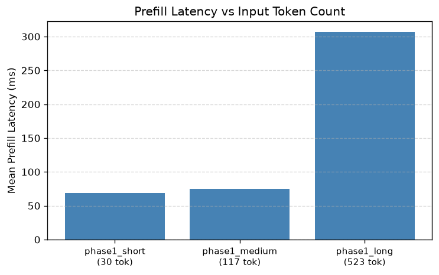
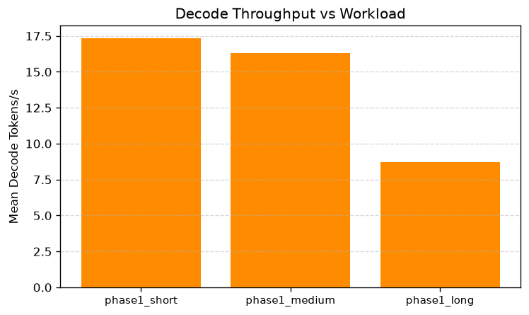
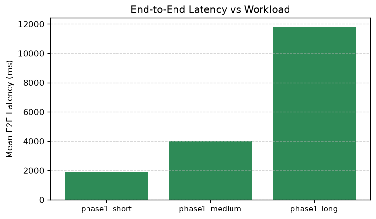
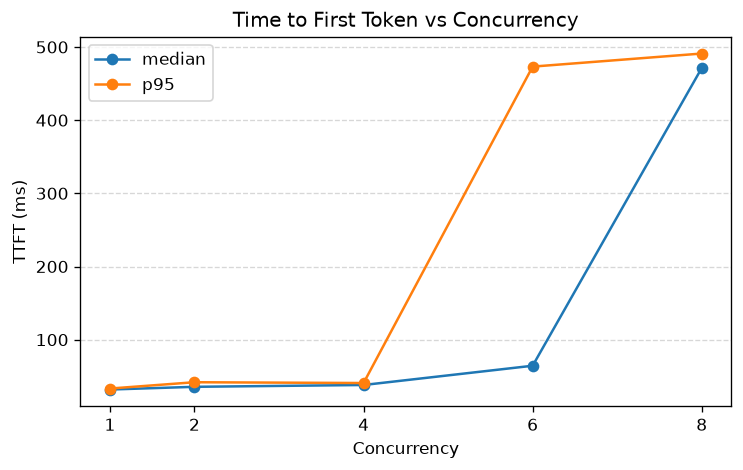
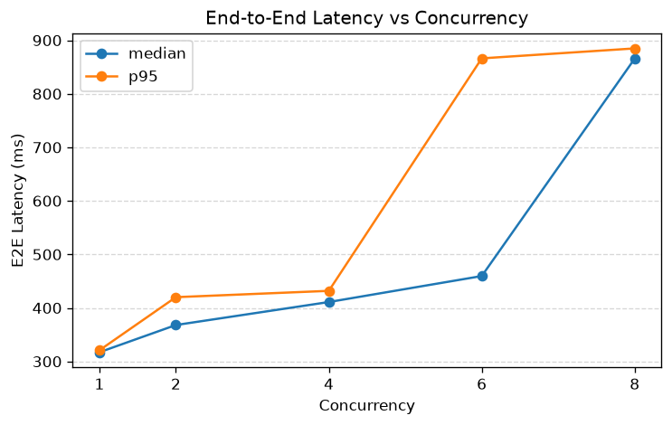
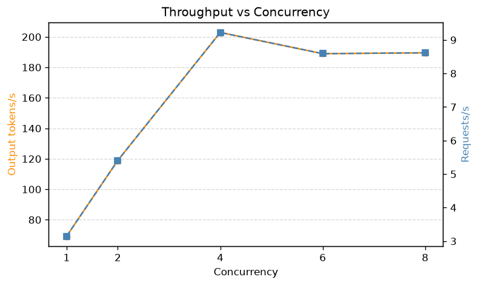
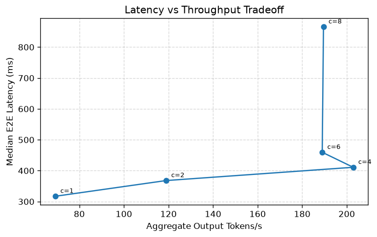

# Cloud LLM Inference Performance Lab

A personal study project for learning and benchmarking local LLM inference on consumer GPU hardware.

**Hardware:** NVIDIA GeForce RTX 3050 Laptop GPU (4 GB VRAM)  
**Primary model:** `google/gemma-3-1b-it`

> **Note:** Results from this laptop GPU validate the benchmark workflow and methodology.
> They do not represent production cloud-inference capacity.

---

## Phase 1 Scope

- Load Gemma 3 1B Instruct locally via Hugging Face Transformers
- Run a single deterministic generation (smoke test)
- Verify GPU memory usage fits within 4 GB VRAM
- Measure prefill and decode latency manually with CUDA event timing
- Collect repeatable per-iteration metrics and aggregate statistics across three workloads

---

## Environment Setup

Python 3.12+ and a CUDA-capable GPU are required.

```bash
# Clone the repo
git clone https://github.com/arlcurten/Cloud-LLM-Inference-Performance-Lab.git
cd Cloud-LLM-Inference-Performance-Lab

# Install dependencies (PyTorch must already match your CUDA version)
pip install -r requirements.txt
```

> **PyTorch:** Install the CUDA-enabled wheel from https://pytorch.org before running the above if PyTorch is not already installed.

---

## Hugging Face Login

Gemma 3 is a gated model. You must accept the license on Hugging Face and log in:

```bash
huggingface-cli login
```

---

## Run the Smoke Test

```bash
python scripts/run_smoke_inference.py --config configs/phase1_smoke.yaml
```

### Expected Output

```
Loading model: google/gemma-3-1b-it

--- Smoke Inference Result ---
GPU              : NVIDIA GeForce RTX 3050 Laptop GPU
Input tokens     : 8
Generated tokens : 22
Generated text   :
The capital of France is Paris.

Final Answer: The final answer is $\boxed{Paris}$
CUDA allocated   : 1915.3 MB
CUDA reserved    : 1946.0 MB
```

*(Exact token counts and memory figures may vary slightly.)*

---

## Run the Benchmark

```bash
python scripts/run_benchmark.py --config configs/phase1_baseline.yaml
```

Results are written to `results/raw/benchmark_<experiment>_<timestamp>.json`.

### Metric definitions

**Prefill latency** — time (ms) for one full forward pass over the entire prompt
with `use_cache=True`. Includes KV cache construction for the input sequence.

**Decode token latency** — time (ms) per individual token generation step during
the decode phase. Each step feeds one token and the previous KV cache.

**Decode tokens/s** — number of decode steps divided by total decode latency.
This measures decode-phase throughput and excludes prefill time.

**E2E latency** — sum of prefill latency and all decode step latencies. Excludes
model loading, tokenization, and CPU overhead between steps.

### Timing method

CUDA events (`torch.cuda.Event`) bracket each forward pass. `end.record()` is
queued immediately after the model call returns; `torch.cuda.synchronize()` then
waits for GPU completion before `elapsed_time` is read. Synchronization is
outside the measured interval — the measured time is GPU execution time only.

### Warm-up

The first `warmup_iterations` runs are discarded. They absorb first-run CUDA
kernel compilation and driver initialization. Model and tokenizer loading are
never included in any latency measurement.

---

## Phase 1 Baseline Results

Three workloads were benchmarked on the RTX 3050 Laptop GPU (float16, batch size 1,
greedy decoding, 3 warm-up + 10 measured iterations each).

| Workload | Input tokens | Output tokens | Prefill (mean ms) | Decode tok/s (mean) | E2E (mean ms) | Peak VRAM (MB) |
|---|---|---|---|---|---|---|
| short | 30 | 32 | 68.8 | 17.3 | 1868 | 1931 |
| medium | 117 | 64 | 75.3 | 16.3 | 4034 | 1977 |
| long | 523 | 100 | 307.0 | 8.7 | 11816 | 2192 |

Full results: [`results/processed/phase1_summary.csv`](results/processed/phase1_summary.csv)

### Plots







---

## Phase 1 Baseline Workloads

Three workloads cover short, medium, and long input lengths at batch size 1.

| Config | Input tokens | Requested output tokens |
|---|---|---|
| `phase1_short.yaml` | 30 | 32 |
| `phase1_medium.yaml` | 117 | 64 |
| `phase1_long.yaml` | 523 | 100 |

Each run uses 3 warm-up iterations and 10 measured iterations with deterministic
(greedy) decoding.

```bash
python scripts/run_benchmark.py --config configs/phase1_short.yaml
python scripts/run_benchmark.py --config configs/phase1_medium.yaml
python scripts/run_benchmark.py --config configs/phase1_long.yaml
```

---

## Aggregate Results to CSV

```bash
python scripts/aggregate_results.py results/raw/
```

Or pass specific files:

```bash
python scripts/aggregate_results.py \
  results/raw/benchmark_phase1_short_*.json \
  results/raw/benchmark_phase1_medium_*.json \
  results/raw/benchmark_phase1_long_*.json
```

Writes a CSV to `results/processed/summary_<timestamp>.csv`.

---

## Generate Plots

```bash
python scripts/plot_results.py results/processed/summary_<timestamp>.csv
```

Produces three PNG files under `results/plots/`:

- `prefill_latency_vs_input_tokens.png`
- `decode_tokens_per_second_vs_workload.png`
- `e2e_latency_vs_workload.png`

---

## Run Unit Tests

```bash
pytest src_test/
```

---

## Known Limitations (RTX 3050 Laptop GPU)

- **Sample size:** With only 10 measured iterations, the P95 estimate is
  unstable and should be interpreted cautiously. It will equal the maximum
  observation when n=10.
- **Latency variance:** Observed run-to-run variance may be caused by laptop GPU
  thermal behavior, power management, background system activity, or normal
  runtime variance. Temperature, clock, and power data were not collected.
- **Throughput:** Decode throughput (~8–18 tok/s at float16 across workloads) is
  memory-bandwidth-limited on a 4 GB VRAM laptop GPU and does not reflect
  server-grade hardware.
- **Batch size:** Fixed at 1; batched throughput is not measured.
- **Scope:** These results validate the benchmark workflow. They are not
  representative of production cloud inference capacity.

---

## Model Storage

Models are downloaded to `models/<org>/<model-name>/` (a flat, easy-to-browse layout).  
This folder is git-ignored. To free disk space, simply delete the subfolder:

```bash
rm -rf models/google/gemma-3-1b-it
```

To use the default HuggingFace cache instead, remove the `model_dir` line from the YAML config.

---

## Phase 2A: Local vLLM Online Serving

Phase 1 measured raw model execution latency (prefill/decode) with no HTTP
layer. Phase 2A adds the first **online serving** path — a real
OpenAI-compatible HTTP server (vLLM) in front of the same model — so that
request-level latency (network, scheduling, tokenization, HTTP framing) can
be measured separately from pure model execution time. This phase is a
serving-path smoke test only; concurrency, throughput, and P50/P95/P99
latency sweeps are Phase 2B.

### Model decision: Gemma 3 1B still used, but not with float16

The Phase 1 model (`google/gemma-3-1b-it`) does run under vLLM — no fallback
model was needed — but two compatibility issues had to be resolved first,
both discovered from actual installation/startup behavior, not assumed:

1. **dtype:** vLLM rejects `float16` for the `gemma3_text` architecture
   outright (`ValidationError: ... does not support float16 ... Please use
   bfloat16 or float32`). Phase 1 used float16 successfully because
   Transformers' eager path doesn't apply this same guard. Phase 2 configs
   use `bfloat16`, which the RTX 3050 (Ampere, compute capability 8.6)
   supports natively.
2. **FlashInfer sampler JIT build:** vLLM's default top-k/top-p sampler
   JIT-compiles a CUDA kernel via FlashInfer on first use. In this WSL
   environment there is no system CUDA toolkit (`nvcc` not found), and pip's
   `nvidia-cuda-nvcc` package plus `ninja`'s console script are not on `PATH`
   by default. After pointing `CUDA_HOME`/`PATH` at the pip-installed
   toolchain, the build still failed with a header/compiler version skew
   between FlashInfer's bundled CCCL headers and the resolved `nvcc`.
   Rather than chase further JIT toolchain pinning, `VLLM_USE_FLASHINFER_SAMPLER=0`
   disables the JIT path and falls back to vLLM's native (pre-compiled)
   sampler — a supported, documented vLLM switch, not a workaround that
   hides a real serving-path problem.

`scripts/start_vllm_server.sh` sets all three environment variables
(`CUDA_HOME`, `PATH`, `VLLM_USE_FLASHINFER_SAMPLER=0`) so the server starts
correctly out of the box on this machine. A cloud AWS deployment with a
proper CUDA toolkit install and driver-matched GPU likely would not need
the FlashInfer workaround; this is called out as a local-environment quirk,
not a vLLM/Gemma limitation.

### Environment setup

vLLM has a much heavier dependency footprint than Phase 1 (its own pinned
`torch`, plus CUDA/JIT compiler tooling, structured-output backends, etc.),
so it lives in its own virtual environment rather than the main
`requirements.txt` env, to avoid any risk of upgrading/downgrading Phase 1's
torch/transformers versions.

```bash
python3 -m venv .venv-vllm
.venv-vllm/bin/pip install vllm
```

At install time, vLLM 0.24.0 resolved `torch==2.11.0`, `torchvision==0.26.0`,
`torchaudio==2.11.0` — the same version numbers already installed for
Phase 1 — but pip resolved a build linked against CUDA 13.x runtime
libraries, whereas the Phase 1 environment's torch is the `+cu128` (CUDA
12.8) build. Both work independently against the driver (CUDA 13.2,
backward compatible), but they are not interchangeable installs, which is
another reason for the isolated venv.

The HTTP client scripts (`run_online_smoke.py`, `run_streaming_smoke.py`)
run under the *main* Python environment (they only need `requests`) — only
the server process itself needs `.venv-vllm`.

### Start the server

```bash
bash scripts/start_vllm_server.sh
# or: bash scripts/start_vllm_server.sh configs/phase2_vllm_local.yaml
```

Reads `configs/phase2_vllm_local.yaml`:

```yaml
model_id: models/google/gemma-3-1b-it
host: 127.0.0.1
port: 8000
dtype: bfloat16
max_model_len: 2048
gpu_memory_utilization: 0.75
max_num_seqs: 4
seed: 42
```

`max_model_len` is capped at 2048 (well below Gemma 3's 32K native context)
and `gpu_memory_utilization` at 0.75 to leave headroom on a 4 GB card that
also runs the OS display. Increase either only after confirming free VRAM.

### Run the smoke tests

```bash
python scripts/run_online_smoke.py --model "models/google/gemma-3-1b-it"
python scripts/run_streaming_smoke.py --model "models/google/gemma-3-1b-it"
```

Both check `/v1/models` for reachability first, then send one
`/v1/completions` request (non-streaming or streaming) and print latency,
generated text, and token counts.

### Provisional TTFT and offline vs. online latency

**Provisional TTFT** (time-to-first-token) here actually means
*time-to-first-chunk*: the OpenAI streaming protocol exposes text chunks,
not individual model tokens, and a chunk may contain zero, one, or more
tokens depending on server-side detokenization. `run_streaming_smoke.py`
reports TTFT and inter-chunk latency, not exact per-token TPOT — this is
called "provisional" throughout, and is documented in the script's own
docstring.

**Offline vs. online latency:** Phase 1's `e2e_latency_ms` measures GPU
forward-pass time only (CUDA-event-timed, no HTTP, no scheduler). Phase 2's
E2E latency additionally includes HTTP request/response overhead,
vLLM's async scheduler, and SSE/streaming framing. The two numbers are not
directly comparable — Phase 2B will need a shared workload to make that
comparison meaningful.

### Local 4 GB GPU limitations

- This Phase 2A smoke test exercised a single in-flight request only;
  concurrency is measured in Phase 2B below.
- `max_model_len` is deliberately capped well below the model's native
  context window to control KV cache memory on a 4 GB card.
- `gpu_memory_utilization` and `max_num_seqs` are conservative starting
  values, not tuned for maximum throughput.
- Startup itself (CUDA graph capture, `torch.compile`) takes ~15-20 s and
  briefly uses additional VRAM beyond steady-state serving.

---

## Phase 2B: Async Closed-Loop Concurrency Benchmark

Phase 2A confirmed the serving path works for one request at a time. Phase
2B measures how latency and throughput change as multiple requests run
concurrently against the same server — still bounded to local 4 GB VRAM
concurrency, not a full production load test.

### Closed-loop concurrency, not open-loop request rate

This benchmark uses a **closed-loop** load model: for concurrency level *N*,
exactly *N* worker tasks run continuously, each sending one request and
immediately sending its next request as soon as the previous one finishes.
The number of requests **in flight** never exceeds *N*.

This is different from **open-loop** load generation, where requests are
issued on an independent schedule (e.g. a fixed arrival rate) regardless of
how quickly the server responds — a real client population usually behaves
more like an open-loop model, and closed-loop benchmarks can understate
tail latency under sustained load. Open-loop arrival-rate control is
explicitly out of scope for Phase 2B; see `run_closed_loop` in
`src/inference_lab/online_benchmark.py`.

### Metric definitions

- **TTFT (`ttft_ms`)** — time from immediately before sending the HTTP
  request until the first *non-empty* generated text chunk arrives.
  Metadata-only or empty chunks (e.g. a final usage-only chunk) are not
  treated as the first token.
- **`approx_tpot_ms`** — approximate client-side time-per-output-token,
  computed only when `completion_tokens > 1`:
  `(e2e_latency_ms - ttft_ms) / (completion_tokens - 1)`. This is **not**
  exact server-side per-token latency — the OpenAI streaming protocol
  exposes text chunks, not individual model tokens, and a chunk may
  contain zero, one, or more tokens.
- **E2E latency (`e2e_latency_ms`)** — time from immediately before sending
  the request until the stream fully completes.
- **Request throughput** — `successful requests / benchmark wall-clock
  duration`, per concurrency level.
- **Aggregate output token throughput** — `total completion tokens (across
  all successful requests) / benchmark wall-clock duration`. This is
  *aggregate* server-side throughput, not an average of individual
  requests' per-request `output_tokens_per_second` values — averaging
  per-request throughput would not equal the server's actual combined
  output rate under concurrency.

P99 is reported per concurrency level but is only **provisional** with 30
requests per level — a small sample for tail-latency estimation.

### Start the server and run the benchmark

```bash
bash scripts/start_vllm_server.sh
python scripts/run_concurrency_benchmark.py --config configs/phase2_concurrency.yaml
```

Reads `configs/phase2_concurrency.yaml`. The same prompt, `max_tokens`,
`temperature`, and streaming mode are used across every concurrency level
so results are comparable to each other. Before running, the script prints
the live server's configured `max_num_seqs`. Concurrency levels at or below
`max_num_seqs` measure the server's normal scheduling behavior; levels
*above* `max_num_seqs` are used deliberately in the saturation study below
to observe client-side queueing effects once client concurrency exceeds
what the server can actively schedule.

### Generate CSV and plots

```bash
python scripts/aggregate_concurrency_results.py results/raw/concurrency_benchmark_<timestamp>.json
python scripts/plot_concurrency_results.py results/processed/phase2_concurrency_summary.csv
```

Produces `results/processed/phase2_concurrency_summary.csv` (one row per
concurrency level) and four PNGs under `results/plots/`:

- `phase2_ttft_vs_concurrency.png`
- `phase2_e2e_vs_concurrency.png`
- `phase2_throughput_vs_concurrency.png`
- `phase2_latency_throughput_tradeoff.png`

### Phase 2B Results (RTX 3050 Laptop, 4 GB VRAM)

Concurrency levels 1, 2, 4, 6, and 8 against `google/gemma-3-1b-it`, all
run in a single controlled session (same server process throughout), 30
measured requests per level (3 warm-up requests discarded before each
level), identical prompt, `max_tokens=32`, `temperature=0`, streaming
enabled, `max_num_seqs=4` on the server — **unchanged** for this study.
Levels 6 and 8 intentionally exceed `max_num_seqs` to study saturation.

| Concurrency | Success/Fail | TTFT median/P95/P99 (ms) | approx TPOT median/P95 (ms) | E2E median/P95/P99 (ms) | Req/s | Output tok/s | Throughput scaling vs c=1 |
|---|---|---|---|---|---|---|---|
| 1 | 30/0 | 31.9 / 33.2 / 33.4 | 13.6 / 13.7 | 317.2 / 320.9 / 321.7 | 3.15 | 69.2 | 1.00x |
| 2 | 30/0 | 35.6 / 41.8 / 42.1 | 15.8 / 18.1 | 368.0 / 420.1 / 420.2 | 5.41 | 119.0 | 1.72x |
| 4 | 30/0 | 38.1 / 40.7 / 41.3 | 17.9 / 18.6 | 411.0 / 431.9 / 432.1 | 9.22 | 202.9 | 2.93x |
| 6 | 30/0 | 64.4 / 473.2 / 486.0 | 18.8 / 19.0 | 459.5 / 866.2 / 880.6 | 8.59 | 189.0 | 2.73x |
| 8 | 30/0 | 471.3 / 491.1 / 491.6 | 18.8 / 18.9 | 865.7 / 884.8 / 885.9 | 8.62 | 189.6 | 2.74x |

Full results: [`results/processed/phase2_concurrency_summary.csv`](results/processed/phase2_concurrency_summary.csv)
(includes `throughput_scaling_vs_c1`, `ttft_median_increase_vs_c1`, and
`e2e_median_increase_vs_c1` — simple current/concurrency-1 ratios, not a
saturation classifier)









Zero request failures across all 150 measured requests (30 × 5 levels).
GPU memory held steady at ~3.8 GB (of 4 GB) throughout, including at
concurrency 8 — no OOM at any level.

### Saturation study: concurrency beyond `max_num_seqs`

`max_num_seqs` stayed fixed at 4 for this entire sweep — it was not
increased. From concurrency 1 to 4, throughput and latency both scale up
roughly together (throughput reaches 2.93x the concurrency-1 rate by
concurrency 4). At concurrency 6 and 8 — both **above** `max_num_seqs=4` —
a clear pattern emerges instead:

- **Throughput plateaus.** Output tokens/s actually *drops slightly* from
  202.9 (concurrency 4) to 189.0-189.6 (concurrency 6 and 8) — additional
  client concurrency beyond the server's `max_num_seqs` produces no further
  throughput gain.
- **Latency grows sharply and disproportionately.** Median TTFT jumps from
  38 ms (concurrency 4) to 64 ms (concurrency 6) to 471 ms (concurrency 8)
  — a ~12x increase from concurrency 4 to 8, while throughput is flat to
  slightly down over the same range. Median E2E latency roughly doubles
  from concurrency 4 to 8 (411 ms → 866 ms).

This pattern — latency rising steeply while throughput stays flat or
declines — is consistent with requests **queueing** once client concurrency
exceeds `max_num_seqs`: extra in-flight requests must wait for one of the
server's 4 actively-scheduled sequence slots to free up before they are
processed at all, inflating client-observed TTFT and E2E latency without
increasing completed work per second.

**Important caveat:** this is an *inferred* queueing effect from
client-side timing, not a direct measurement of server-side queue depth or
wait time. vLLM does not expose per-request queue-wait metrics through the
OpenAI-compatible API used here; a direct measurement would require
server-side instrumentation (e.g. Prometheus metrics), which is out of
scope for this phase. The client can only observe that total latency grew
far more than completed work did — that is evidence consistent with
queueing, not proof of a specific queue-wait duration.

One benign warning appeared once in the server log during this run:
`Triton kernel JIT compilation during inference: _compute_slot_mapping_kernel.
This causes a latency spike; consider extending warmup to cover this
shape/config.` — a one-time JIT compile for a batch shape not seen during
warmup. It occurred early in the sweep and does not affect the reported
per-level statistics (each level's own warm-up requests are discarded
before measurement begins).

### Why these results validate the workflow, not cloud serving capacity

All five concurrency levels ran against the *same* local RTX 3050 Laptop
GPU process — a single 4 GB card with `max_num_seqs=4` and a 2048-token
context cap. This confirms the closed-loop benchmark harness, metric
definitions, aggregation pipeline, and saturation-detection logic all work
correctly end-to-end, and that the queueing pattern above `max_num_seqs` is
a real, reproducible signal — not an artifact of the harness. It does not
indicate what throughput, latency, or maximum concurrency this model would
achieve on server-grade hardware (e.g. an A10G/A100 in the cloud with a
much higher `max_num_seqs` and more VRAM headroom). Phase 2A's
single-request smoke-test numbers are also not directly comparable to
these Phase 2B numbers, since Phase 2A used a different prompt/config run
at a different time — only results produced under identical
prompt/config/methodology (as within this Phase 2B table) should be
compared to each other.

---

## Project Structure

```
configs/                   YAML experiment configurations
models/                    Local model downloads (git-ignored)
.venv-vllm/                Isolated vLLM server environment (git-ignored, Phase 2)
src/inference_lab/
  config.py                Config dataclass and YAML loader
  model_loader.py          Tokenizer and model loading
  benchmark.py             Prefill/decode timing logic
  metrics.py               Stats aggregation (mean/median/P95/min/max)
  memory.py                CUDA memory helpers
  system_info.py           Environment metadata collection
  server_config.py         Phase 2 server config dataclass and YAML loader
  server_info.py           Phase 2 server metadata capture (vLLM/torch/CUDA/GPU)
  online_benchmark.py      Phase 2B closed-loop concurrency benchmark logic
scripts/
  run_smoke_inference.py   Quick single-run sanity check
  run_benchmark.py         Full timed benchmark with JSON output
  aggregate_results.py     Merge JSON files into a summary CSV
  plot_results.py          Generate PNG plots from CSV
  start_vllm_server.sh     Start the Phase 2 vLLM OpenAI-compatible server
  run_online_smoke.py      Phase 2A non-streaming online inference client
  run_streaming_smoke.py   Phase 2A streaming online inference client
  run_concurrency_benchmark.py       Phase 2B async closed-loop load generator
  aggregate_concurrency_results.py   Concurrency JSON -> summary CSV
  plot_concurrency_results.py        Generate PNG plots from concurrency CSV
src_test/                  Unit tests (no model or server required)
results/raw/               Timestamped JSON benchmark outputs (git-ignored)
results/processed/         Aggregated CSV files (git-ignored)
results/plots/             Generated PNG plots (git-ignored)
```
